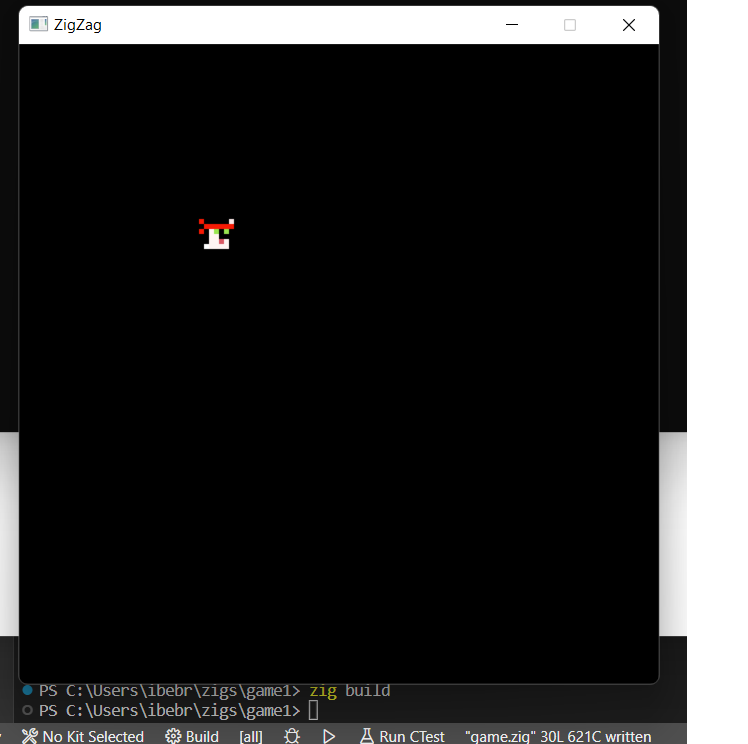

# Zigzag

An extremely minimal game system for zig, inspired by another project: https://github.com/beta-bytes/bbmicro and pico8.

## Building

### Windows

Aside from zig (obviously), you need both SDL2 and SDL_Image development releases.

1. Download the sdl development release SDL2-devel-2.26.1-VC and unzip in the main directory of this repo.
2. Download the sdl2 image development release SDL2_image-devel-2.6.2-VC and unzip in the main directory of this repo.

You should now be able to `zig build`. To run, you will need to copy the run time dependencies to the correct folder:

3. Copy the dlls SDL2.dll and SDL2_image.dll from the unzipped folders (the 64 bit versions) from above to the build directory (zig-out/bin)

### Other Systems (Mac / Linux)

Coming soon...

## Current Status

Right now building an experemintal port of another project I have worked on (ibebrett) in rust. The initial commits are going to be hacking and trying things out.
