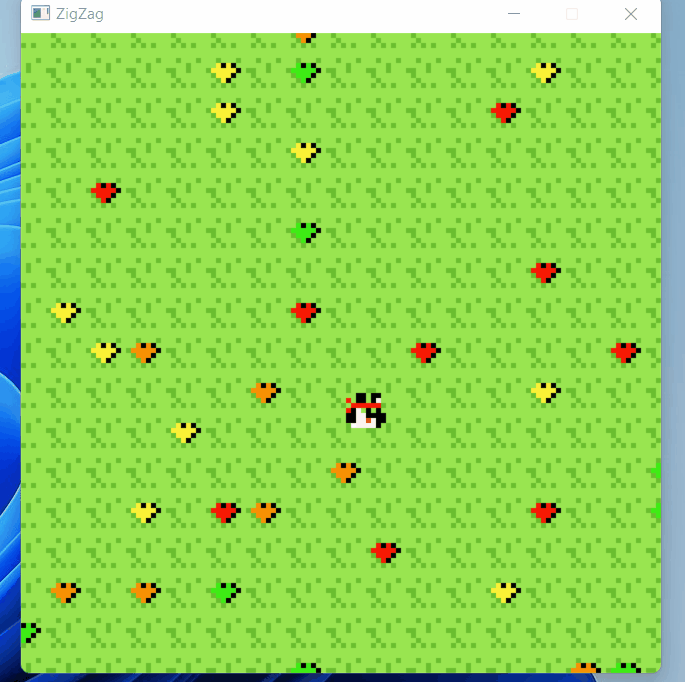

# Zigzag

An extremely minimal game system for zig, inspired by another project: https://github.com/beta-bytes/bbmicro and pico8.



## Building

You can right now either build using SDL (on windows (more platforms coming)), or WASM.

### Windows + SDL

Aside from zig (obviously), you need both SDL2 and SDL_Image development releases.

1. Download the sdl development release SDL2-devel-2.26.1-VC and unzip in the main directory of this repo.
2. Download the sdl2 image development release SDL2_image-devel-2.6.2-VC and unzip in the main directory of this repo.
3. Copy the dlls SDL2.dll and SDL2_image.dll from the unzipped folders (the 64 bit versions) from above to the build directory (zig-out/bin)
4. Run `zig build`

### WASM

1. `zig build-lib src/main_wasm.zig -target wasm32-freestanding -dynamic -OReleaseFast`
2. Serve the conents of the root of this directory with a webserver. If you like python you can run ```python -m http.server` and go to http://localhost:8000.

## Usage

The main idea is to implement the methods of `Game`. You then directly interact with the api. Details such as windowing system, graphics system are abstracted away (in this case SDL is powering zigzag, but this can be swapped out for a different system later).

The two methods you must implement are:

`update` where you should update your game state.
`draw` where you should do all of your drawing.

### Graphics

The screen is 128x128 (ala pico8).
Sprites are 8x8, but can be drawn anywhere on the screen.

### Input

There are only 6 buttons supported: A (a), S (s), Up, Down, Left, Right.

You can read the state of them with `btnp` to see if the button has been pressed this frame, or `btn` to see if the button is currently held down.

### Full API Docs

coming soon...

## Current Status

Right now building an experemintal port of another project I have worked on (ibebrett) in rust. The initial commits are going to be hacking and trying things out.
